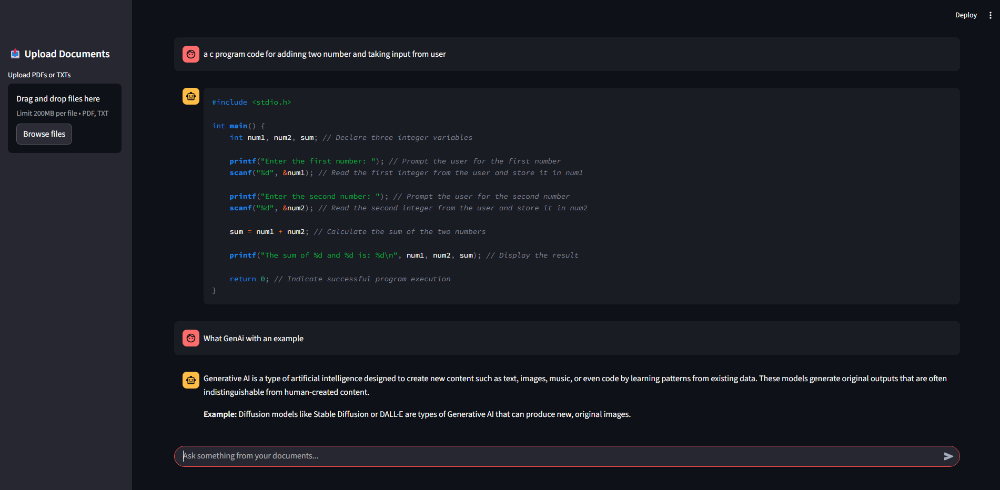

# 📚 Multi-Document RAG Chatbot with Gemini  
[](https://www.python.org/)
[](https://opensource.org/licenses/MIT)
[](https://github.com/Deepakkumar5570/rag-multidoc-chatbot/stargazers)
[](https://github.com/Deepakkumar5570/rag-multidoc-chatbot/issues)

An AI-powered chatbot that leverages **Retrieval-Augmented Generation (RAG)** to answer queries from multiple PDF and text documents. Built with **LangChain**, **Google Gemini API**, and **ChromaDB** for embeddings and retrieval.  

This project allows you to upload a collection of documents (research papers, books, notes, etc.) and interact with them conversationally through an intelligent assistant.  

## 🖥️ Demo  
- Lets Try Out Live App -- https://letstart.streamlit.app/

Here’s how the chatbot looks in action:  

### Homepage  
 


---

## ✨ Features  

- 🔍 **Multi-document support** (PDFs & text files)  
- ⚡ **RAG-based retrieval** for precise, context-aware answers  
- 🤖 Powered by **Gemini API** for natural responses  
- 💾 Persistent **ChromaDB vector storage** for embeddings  
- 📑 Preprocessing with **chunking** for better semantic search  
- 🖥️ **Streamlit UI** with chat-style interface  
- 🔄 Easy **rebuild script** to refresh embeddings when adding new documents  

---

## 📂 Project Structure  

```bash
RAG_Q&A_Chatbot/
│── chroma_db/                # auto-generated vector database
│── data/
│   ├── pdfs/                 # place your PDF documents here
│   ├── txts/                 # place your TXT documents here
│── uploads/                # <== NEW (user uploaded docs stored here)
│── src/
│   ├── __init__.py
│   ├── app.py              # Chatbot UI / API entry
│   ├── chatbot.py           # LangChain + Gemini pipeline
│   ├── config.py          # API keys, model configs
│   ├── data_loader.py      # load PDFs & TXTs
│   ├── preprocess.py       # split & clean documents
│   ├── embed_store.py        # create/load vectorstore
│   ├── upload_handler.py   # <== NEW (upload logic)
│── update_db.py              # automatic detect the new data and stored in chroma db
│── rebuild_db.py
│── requirements.txt
│── .env or .streamlit/secrets.toml


```
## Technical Stack

| Layer             | Tools                                                 |
| ----------------- | ----------------------------------------------------- |
| **Frontend/UI**   | Streamlit                                             |
| **LLM**           | Google Gemini (via `langchain_google_genai`)          |
| **Embeddings**    | `GoogleGenerativeAIEmbeddings` (`text-embedding-004`) |
| **Vector DB**     | Chroma                                                |
| **Orchestration** | LangChain                                             |
| **Memory**        | ConversationBufferMemory                              |
| **Persistence**   | Local disk (`chroma_db/`, `uploads/`, `data/`)        |


## How To Use 

- Clone the repository
-     git clone https://github.com/Deepakkumar5570/RAG_Q&A_Chatbot.git
      cd RAG_Q&A_Chatbot
  
 ##  Create & activate a virtual environment
       python -m venv venv
       source venv/bin/activate   # Mac/Linux
       venv\Scripts\activate      # Windows
## Install dependencies
       pip install -r requirements.txt

 ## Set up environment variables
 Create a .env file in the root directory:
 
      GEMINI_API_KEY=your_gemini_api_key_here
## Usage
start the chatbot 

        streamlit run src/app.py
## Rebuild the database (after adding new documents) if want to full rebuilt database
        python rebuild_db.py
## after adding new pdfs or texts(don't want rebuild,only for new inserted data)
       python updated_db.py
##  📘 Dataset Used

Currently trained on:

  - 30+ Project Gutenberg books

  - 50+ Research papers

  - 15+ Miscellaneous text documents

You can extend by dropping more PDFs or TXTs into:

   - data/pdfs/

  -  data/txts/

##  Roadmap
  -  Add support for DOCX & HTML documents
  -  Advanced metadata filtering (author, year, category)

  - UI for uploading documents directly

  - Evaluation pipeline for RAG performance

## Contributing

Contributions are welcome! Feel free to open issues or submit pull requests.

## 
👤 Author: Deepak Kumar
---
  Here is my Contact Information 👉    
-  My contact Email →  `dk0778671@gmail.com`
-  My Linkedin profile → `www.linkedin.com/in/deepak-kumar-029781263`
-  GitHub profile →  `github.com/Deepakkumar5570`

## 🛠️ Tech Stack  

  
  
  
  
  
  
  
  

## 
- Copyright©️ Deepak Kumar Inc. All rights reserved.
 


